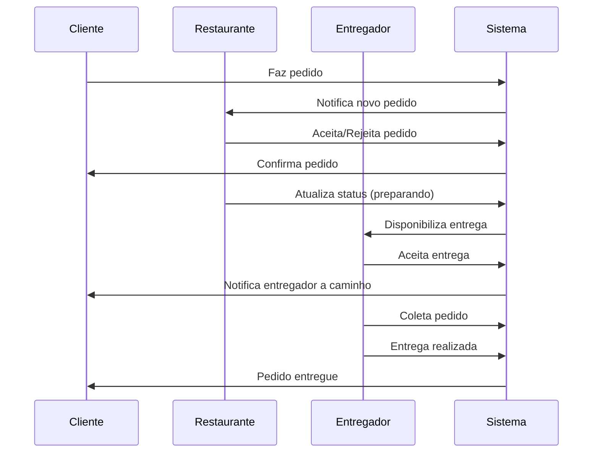
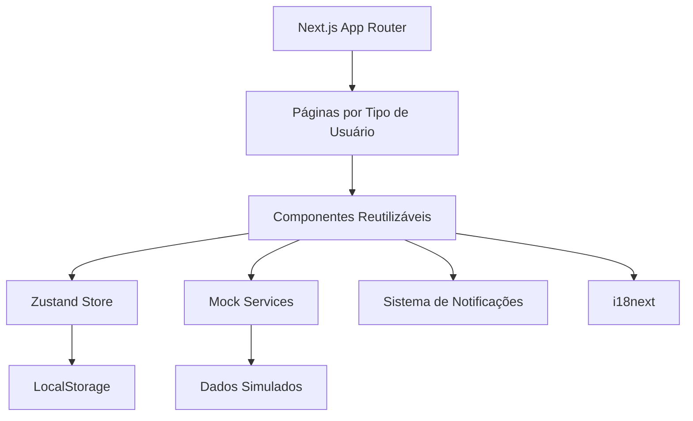
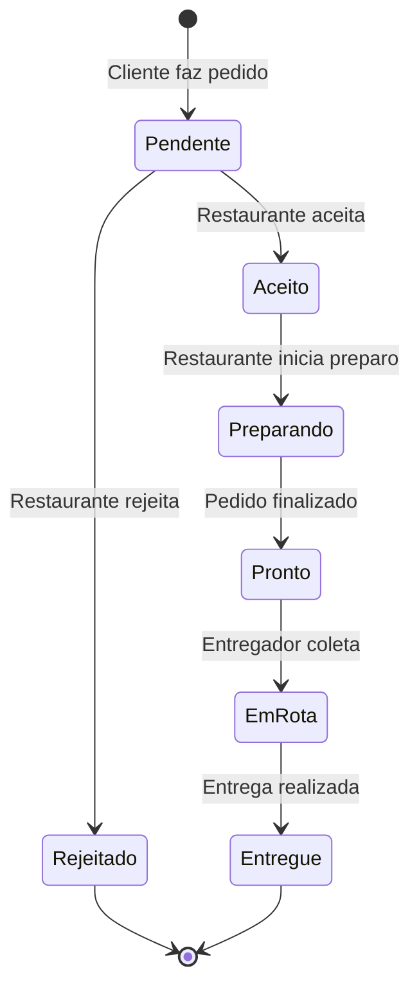

# 🍕 ZipFood - Sistema de Delivery Simplificado

> **Plataforma de delivery inspirada no iFood** - Um marketplace simplificado que conecta clientes, restaurantes e entregadores em um ecossistema de delivery on-demand.

## 📋 Índice

- [Visão Geral do Sistema](#-visão-geral-do-sistema)
- [Como Funciona](#-como-funciona)
- [Arquitetura Técnica](#-arquitetura-técnica)
- [Stack Tecnológica](#-stack-tecnológica)
- [Estrutura do Projeto](#-estrutura-do-projeto)
- [Funcionalidades por Ator](#-funcionalidades-por-ator)
- [Fluxo de Pedidos](#-fluxo-de-pedidos)
- [Sistema de Notificações](#-sistema-de-notificações)
- [Configuração e Instalação](#-configuração-e-instalação)
- [Desenvolvimento](#-desenvolvimento)
- [Testes](#-testes)
- [Internacionalização](#-internacionalização)

## 🎯 Visão Geral do Sistema

**ZipFood** é uma versão simplificada do iFood, construída com Next.js 15 e React 19. O sistema conecta três tipos de usuários em um marketplace de delivery:

### 👥 Atores do Sistema

1. **🛒 Clientes** - Fazem pedidos, acompanham entregas e avaliam experiência
2. **🏪 Restaurantes** - Gerenciam cardápios, processam pedidos e controlam disponibilidade
3. **🚴 Entregadores** - Aceitam entregas, atualizam status e completam rotas

### 🎨 Características Principais

- **Interface Unificada**: Uma aplicação web que serve os três tipos de usuário
- **Tempo Real**: Atualizações instantâneas de status de pedidos
- **Multi-idioma**: Suporte a Português, Inglês e Hebraico (com RTL)
- **Sistema Mock**: Funciona sem backend real, ideal para demonstrações
- **Responsivo**: Otimizado para desktop e mobile
- **Notificações**: Sistema completo de alertas e notificações

## 🔄 Como Funciona

### Fluxo Principal do Sistema



### Modelo de Negócio Simplificado

1. **Cadastro**: Usuários se registram escolhendo seu tipo (cliente/restaurante/entregador)
2. **Catálogo**: Restaurantes cadastram seus pratos e preços
3. **Pedidos**: Clientes navegam, escolhem pratos e fazem pedidos
4. **Logística**: Sistema conecta pedidos com entregadores disponíveis
5. **Acompanhamento**: Todos os atores recebem atualizações em tempo real
6. **Avaliação**: Sistema de feedback para melhoria contínua

## 🏗️ Arquitetura Técnica

### Arquitetura Frontend-Only



### Padrões de Design

- **Component-Based**: Arquitetura baseada em componentes React
- **State Management**: Zustand para estado global centralizado
- **Mock Services**: Simulação de APIs para desenvolvimento independente
- **Real-time Updates**: Sistema de eventos para atualizações instantâneas
- **Responsive Design**: Interface adaptável a diferentes dispositivos

## 🛠️ Stack Tecnológica

### Core Framework
- **Next.js 15.5.2** - Framework React com App Router
- **React 19.1.0** - Biblioteca de interface de usuário
- **TypeScript 5** - Tipagem estática
- **Turbopack** - Bundler de alta performance

### UI e Estilização
- **Tailwind CSS 4** - Framework CSS utility-first
- **Framer Motion 12** - Animações e transições
- **Headless UI 2** - Componentes acessíveis
- **Lucide React** - Ícones modernos
- **React Icons 5** - Biblioteca de ícones

### Estado e Dados
- **Zustand 4.5** - Gerenciamento de estado global
- **React Hook Form** - Gestão de formulários
- **React Hot Toast** - Sistema de notificações

### Internacionalização
- **i18next 23.7** - Framework de internacionalização
- **react-i18next 13.5** - Integração React
- **i18next-browser-languagedetector** - Detecção automática de idioma

### Animações e Interações
- **Lottie React 2.4** - Animações Lottie
- **Unicorn Studio React** - Animações avançadas
- **Framer Motion** - Animações de componentes

### Testes
- **Playwright 1.55** - Testes E2E
- **TestSprite** - Testes automatizados com IA
- **Jest** - Testes unitários

### Desenvolvimento
- **ESLint** - Linting de código
- **Prettier** - Formatação de código
- **Husky** - Git hooks

## 📁 Estrutura do Projeto

```
zip-food/
├── 📁 src/                          # Código fonte principal
│   ├── 📁 app/                      # App Router do Next.js
│   │   ├── 📁 api/                  # API Routes (mock endpoints)
│   │   │   └── notifications/       # Endpoint de notificações
│   │   ├── 📁 auth/                 # Páginas de autenticação
│   │   │   ├── sign-in/             # Login unificado
│   │   │   └── sign-up/             # Registro com seleção de tipo
│   │   ├── 📁 cliente/              # Dashboard do cliente (PT)
│   │   ├── 📁 customer/             # Dashboard do cliente (EN)
│   │   │   ├── orders/              # Histórico de pedidos
│   │   │   ├── profile/             # Perfil do cliente
│   │   │   └── page.tsx             # Dashboard principal
│   │   ├── 📁 restaurant/           # Dashboard do restaurante
│   │   │   ├── orders/              # Gestão de pedidos recebidos
│   │   │   ├── menu/                # Gestão do cardápio
│   │   │   ├── profile/             # Perfil do restaurante
│   │   │   └── page.tsx             # Dashboard principal
│   │   ├── 📁 delivery/             # Dashboard do entregador
│   │   ├── 📁 entregador/           # Dashboard do entregador (PT)
│   │   │   ├── orders/              # Pedidos disponíveis
│   │   │   ├── active/              # Entregas ativas
│   │   │   ├── profile/             # Perfil do entregador
│   │   │   └── page.tsx             # Dashboard principal
│   │   ├── layout.tsx               # Layout raiz com providers
│   │   ├── page.tsx                 # Página inicial (seleção de tipo)
│   │   ├── globals.css              # Estilos globais
│   │   └── favicon.ico              # Ícone da aplicação
│   ├── 📁 components/               # Componentes reutilizáveis
│   │   ├── 📁 ui/                   # Componentes base do design system
│   │   ├── 📁 dev/                  # Ferramentas de desenvolvimento
│   │   ├── AlertSystem.tsx          # Sistema de alertas globais
│   │   ├── AuthCheck.tsx            # Verificação de autenticação
│   │   ├── ClientLayout.tsx         # Layout específico do cliente
│   │   ├── ConnectivityStatus.tsx   # Status de conectividade
│   │   ├── GlobalHeader.tsx         # Cabeçalho adaptável por tipo
│   │   ├── NotificationCenter.tsx   # Central de notificações
│   │   ├── NotificationSystem.tsx   # Sistema de notificações toast
│   │   ├── ProtectedRoute.tsx       # Proteção de rotas por tipo
│   │   ├── RestaurantCarousel.tsx   # Carrossel de restaurantes
│   │   ├── RestaurantSummary.tsx    # Resumo do restaurante
│   │   ├── RestaurantWizard.tsx     # Wizard de configuração
│   │   └── WelcomeMessage.tsx       # Mensagem de boas-vindas
│   ├── 📁 hooks/                    # Custom hooks
│   │   ├── useConnectivity.ts       # Detecção de conectividade
│   │   ├── useNotification.ts       # Gerenciamento de notificações
│   │   └── useRealTimeNotifications.ts # Notificações em tempo real
│   ├── 📁 services/                 # Camada de serviços (mock)
│   │   ├── auth.service.ts          # Autenticação e sessão
│   │   ├── menu.service.ts          # Gestão de cardápios
│   │   ├── notification.service.ts  # Serviço de notificações
│   │   ├── order.service.ts         # Gestão de pedidos
│   │   ├── restaurant.service.ts    # Dados de restaurantes
│   │   ├── restaurant-config.service.ts # Configurações
│   │   └── sync.service.ts          # Sincronização de dados
│   ├── 📁 store/                    # Gerenciamento de estado global
│   │   └── auth.store.ts            # Estado de autenticação
│   ├── 📁 types/                    # Definições de tipos TypeScript
│   │   ├── menu.ts                  # Tipos do cardápio
│   │   ├── restaurant.ts            # Tipos do restaurante
│   │   └── restaurant-config.ts     # Tipos de configuração
│   ├── 📁 lib/                      # Utilitários e configurações
│   │   ├── platform.ts              # Detecção de plataforma
│   │   └── utils.ts                 # Utilitários gerais
│   ├── 📁 utils/                    # Utilitários específicos
│   │   ├── index.ts                 # Exportações principais
│   │   └── validation.ts            # Validações de formulário
│   ├── 📁 constants/                # Constantes da aplicação
│   │   └── index.ts                 # Constantes gerais
│   └── 📁 animations/               # Animações Lottie
│       ├── Food & Beverage.json     # Animação de comida
│       ├── Main Scene.json          # Cena principal
│       └── Store.json               # Animação de loja
├── 📁 database/                     # Estrutura do banco (referência)
│   └── migrations/
│       └── 001_create_tables.sql    # Schema das tabelas
├── 📁 tests/                        # Testes E2E com Playwright
│   ├── auth-customer.spec.ts        # Autenticação do cliente
│   ├── auth-delivery.spec.ts        # Autenticação do entregador
│   ├── auth-restaurant.spec.ts      # Autenticação do restaurante
│   ├── internationalization.spec.ts # Testes de i18n
│   ├── order-status-updates.spec.ts # Atualizações de status
│   └── restaurant-navigation.spec.ts # Navegação do restaurante
├── 📁 testsprite_tests/             # Testes automatizados com IA
│   ├── [20 casos de teste Python]   # Testes abrangentes
│   ├── testsprite_frontend_test_plan.json
│   └── standard_prd.json
├── 📁 scripts/                      # Scripts de automação
├── 📁 public/                       # Arquivos estáticos
│   └── [ícones SVG]                 # Ícones da interface
├── 📄 next.config.ts                # Configuração do Next.js
├── 📄 playwright.config.ts          # Configuração dos testes E2E
├── 📄 tailwind.config.js            # Configuração do Tailwind CSS
├── 📄 tsconfig.json                 # Configuração do TypeScript
├── 📄 package.json                  # Dependências e scripts
└── 📄 README.md                     # Este arquivo
```

## 👥 Funcionalidades por Ator

### 🛒 Cliente
**Jornada do Usuário:**
1. **Cadastro/Login**: Registro simples com email e senha
2. **Navegação**: Visualiza lista de restaurantes disponíveis
3. **Cardápio**: Explora pratos, preços e descrições
4. **Pedido**: Adiciona itens ao carrinho e finaliza pedido
5. **Acompanhamento**: Recebe atualizações em tempo real do status
6. **Histórico**: Acessa pedidos anteriores e pode repetir

**Funcionalidades Específicas:**
- Dashboard com restaurantes próximos
- Carrinho de compras persistente
- Acompanhamento de pedidos em tempo real
- Histórico completo de pedidos
- Sistema de avaliações
- Notificações push sobre status do pedido

### 🏪 Restaurante
**Operações Principais:**
1. **Configuração**: Cadastro do restaurante e informações básicas
2. **Cardápio**: Gestão completa de pratos, preços e disponibilidade
3. **Pedidos**: Recebimento e processamento de novos pedidos
4. **Status**: Atualização do status de preparo dos pedidos
5. **Histórico**: Visualização de todos os pedidos processados

**Funcionalidades Específicas:**
- Dashboard com pedidos pendentes
- Gestão de cardápio (CRUD completo)
- Controle de disponibilidade de pratos
- Atualização de status de pedidos
- Relatórios de vendas
- Configurações do restaurante

### 🚴 Entregador
**Fluxo de Trabalho:**
1. **Disponibilidade**: Marca-se como disponível para entregas
2. **Pedidos**: Visualiza pedidos disponíveis para entrega
3. **Aceitação**: Aceita pedidos compatíveis com sua localização
4. **Coleta**: Confirma coleta do pedido no restaurante
5. **Entrega**: Atualiza status durante o trajeto até o cliente
6. **Finalização**: Confirma entrega e recebe avaliação

**Funcionalidades Específicas:**
- Dashboard com pedidos disponíveis
- Sistema de aceitação de entregas
- Acompanhamento de entregas ativas
- Histórico de entregas realizadas
- Sistema de avaliações
- Controle de disponibilidade

## 🔄 Fluxo de Pedidos

### Estados do Pedido


### Notificações por Estado
- **Pendente**: Restaurante recebe notificação de novo pedido
- **Aceito**: Cliente recebe confirmação do pedido
- **Preparando**: Cliente é informado que pedido está sendo preparado
- **Pronto**: Entregadores recebem notificação de pedido disponível
- **Em Rota**: Cliente recebe dados do entregador e tempo estimado
- **Entregue**: Todos os atores são notificados da conclusão

## 📱 Sistema de Notificações

### Tipos de Notificação
1. **Toast**: Alertas temporários na interface
2. **Centro de Notificações**: Histórico persistente de alertas
3. **Badges**: Indicadores visuais de itens pendentes
4. **Atualizações em Tempo Real**: Mudanças instantâneas na UI

### Canais de Comunicação
- **Interna**: Sistema de eventos entre componentes
- **LocalStorage**: Persistência de notificações offline
- **Mock WebSocket**: Simulação de atualizações em tempo real
- **Service Workers**: Preparado para notificações push (futuro)

## 🚀 Configuração e Instalação

### Pré-requisitos

- **Node.js** 18.17+ ou 20.0+
- **npm** 9.0+ ou **yarn** 1.22+
- **Git** para controle de versão

### Instalação Rápida

```bash
# 1. Clone o repositório
git clone https://github.com/seu-usuario/zip-food.git
cd zip-food

# 2. Instale as dependências
npm install

# 3. Execute o servidor de desenvolvimento
npm run dev

# 4. Acesse http://localhost:3000
```

### Primeiro Acesso

1. **Página Inicial**: Escolha o tipo de usuário (Cliente, Restaurante, Entregador)
2. **Registro**: Crie uma conta com email e senha
3. **Dashboard**: Acesse as funcionalidades específicas do seu tipo de usuário

### Usuários de Teste

```javascript
// Credenciais pré-configuradas para testes
Cliente: {
  email: 'cliente@zipfood.com',
  senha: '123456'
}

Restaurante: {
  email: 'restaurante@zipfood.com',
  senha: '123456'
}

Entregador: {
  email: 'entregador@zipfood.com',
  senha: '123456'
}
```

## 💻 Desenvolvimento

### Scripts Disponíveis

```bash
# Desenvolvimento
npm run dev              # Servidor de desenvolvimento (Turbopack)
npm run build            # Build de produção
npm run start            # Servidor de produção
npm run lint             # Verificação de código
npm run lint:fix         # Correção automática

# Testes
npm run test:e2e         # Testes E2E com Playwright
npm run test:ui          # Interface dos testes Playwright
```

### Arquitetura de Componentes

#### Estrutura Hierárquica

```
src/components/
├── ui/                  # Componentes base (Button, Input, Card)
├── layout/              # Layouts e estruturas (Header, Sidebar)
├── forms/               # Formulários específicos
├── business/            # Lógica de negócio (OrderCard, MenuCard)
└── dev/                 # Ferramentas de desenvolvimento
```

#### Exemplo de Componente

```typescript
// src/components/business/OrderCard.tsx
interface OrderCardProps {
  order: Order;
  userType: 'customer' | 'restaurant' | 'delivery';
  onStatusUpdate?: (orderId: string, status: OrderStatus) => void;
}

export const OrderCard: React.FC<OrderCardProps> = ({ 
  order, 
  userType, 
  onStatusUpdate 
}) => {
  const { t } = useTranslation();
  
  return (
    <Card className="p-4">
      <div className="flex justify-between items-center">
        <h3>{order.restaurantName}</h3>
        <StatusBadge status={order.status} />
      </div>
      
      {/* Renderização condicional por tipo de usuário */}
      {userType === 'restaurant' && (
        <OrderActions 
          orderId={order.id}
          onStatusUpdate={onStatusUpdate}
        />
      )}
    </Card>
  );
};
```

### Gestão de Estado

#### Zustand para Estado Global

```typescript
// src/store/auth.store.ts
interface AuthState {
  user: User | null;
  userType: UserType | null;
  isAuthenticated: boolean;
  
  login: (email: string, password: string, type: UserType) => Promise<void>;
  logout: () => void;
  updateProfile: (data: Partial<User>) => void;
}

export const useAuthStore = create<AuthState>()((set, get) => ({
  user: null,
  userType: null,
  isAuthenticated: false,
  
  login: async (email, password, type) => {
    const user = await authService.login(email, password, type);
    set({ user, userType: type, isAuthenticated: true });
  },
  
  logout: () => {
    authService.logout();
    set({ user: null, userType: null, isAuthenticated: false });
  }
}));
```

### Sistema Mock

#### Serviços Simulados

```typescript
// src/services/order.service.ts
class OrderService {
  private orders: Order[] = [];
  
  async createOrder(orderData: CreateOrderData): Promise<Order> {
    const order: Order = {
      id: generateId(),
      ...orderData,
      status: 'pending',
      createdAt: new Date()
    };
    
    this.orders.push(order);
    
    // Simula notificação em tempo real
    this.notifyOrderUpdate(order);
    
    return order;
  }
  
  async updateOrderStatus(orderId: string, status: OrderStatus): Promise<void> {
    const order = this.orders.find(o => o.id === orderId);
    if (order) {
      order.status = status;
      order.updatedAt = new Date();
      this.notifyOrderUpdate(order);
    }
  }
  
  private notifyOrderUpdate(order: Order) {
    // Simula WebSocket/Server-Sent Events
    window.dispatchEvent(new CustomEvent('orderUpdate', { 
      detail: order 
    }));
  }
}
```

## 🧪 Testes

### Estratégia de Testes

#### Testes E2E com Playwright

O projeto possui uma suíte completa de testes end-to-end que cobrem:

```typescript
// tests/auth-customer.spec.ts
import { test, expect } from '@playwright/test';

test.describe('Autenticação do Cliente', () => {
  test('deve fazer login com sucesso', async ({ page }) => {
    await page.goto('/auth/sign-in');
    
    // Seleciona tipo de usuário
    await page.selectOption('[data-testid="user-type"]', 'customer');
    
    // Preenche credenciais
    await page.fill('[data-testid="email"]', 'cliente@zipfood.com');
    await page.fill('[data-testid="password"]', '123456');
    
    // Submete formulário
    await page.click('[data-testid="submit"]');
    
    // Verifica redirecionamento
    await expect(page).toHaveURL('/customer');
    await expect(page.locator('h1')).toContainText('Dashboard do Cliente');
  });
});
```

#### Casos de Teste Implementados

1. **Autenticação**
   - Login/registro para cada tipo de usuário
   - Validação de credenciais inválidas
   - Persistência de sessão

2. **Fluxos de Negócio**
   - Cliente: navegação, pedidos, acompanhamento
   - Restaurante: gestão de cardápio, processamento de pedidos
   - Entregador: aceitação e conclusão de entregas

3. **Funcionalidades Transversais**
   - Internacionalização e RTL
   - Sistema de notificações
   - Responsividade
   - Conectividade offline

#### Testes Automatizados com IA (TestSprite)

O projeto inclui 20 casos de teste automatizados:

- **TC001-TC003**: Autenticação por tipo de usuário
- **TC005-TC007**: Fluxos completos de pedido
- **TC008**: Sincronização em tempo real
- **TC009**: Suporte multi-idioma
- **TC011**: Sistema de notificações
- **TC012**: Gestão de conectividade

### Executando os Testes

```bash
# Testes E2E interativos
npm run test:e2e

# Interface visual dos testes
npm run test:ui

# Testes em modo headless
npx playwright test

# Testes específicos
npx playwright test auth-customer
```

## 🌍 Internacionalização

### Idiomas Suportados

- **🇧🇷 Português (Brasil)** - Idioma principal
- **🇺🇸 English** - Tradução automática
- **🇮🇱 עברית (Hebrew)** - Com suporte RTL completo

### Implementação

O sistema usa `i18next` com detecção automática de idioma:

```typescript
// Uso em componentes
import { useTranslation } from 'react-i18next';

const Component = () => {
  const { t, i18n } = useTranslation();
  
  return (
    <div>
      <h1>{t('welcome.title')}</h1>
      <button onClick={() => i18n.changeLanguage('en')}>
        {t('common.changeLanguage')}
      </button>
    </div>
  );
};
```

### Suporte RTL

O layout se adapta automaticamente para idiomas RTL:

```css
/* Aplicado automaticamente para hebraico */
[dir="rtl"] {
  direction: rtl;
}

[dir="rtl"] .text-left {
  text-align: right;
}
```

### Estrutura de Traduções

```json
{
  "common": {
    "loading": "Carregando...",
    "save": "Salvar",
    "cancel": "Cancelar"
  },
  "auth": {
    "login": "Entrar",
    "register": "Cadastrar",
    "selectUserType": "Selecione o tipo de usuário"
  },
  "customer": {
    "dashboard": {
      "title": "Bem-vindo ao ZipFood",
      "subtitle": "Encontre os melhores restaurantes"
    }
  }
}
```

---

## 🚀 Próximos Passos

### Funcionalidades Planejadas

- **🗺️ Integração com Mapas**: Google Maps para rastreamento real
- **💳 Pagamentos**: Gateway de pagamento real
- **📊 Analytics**: Dashboard de métricas e relatórios
- **🔔 Push Notifications**: Notificações nativas
- **📱 App Mobile**: Versão React Native

### Melhorias Técnicas

- **Backend Real**: Migração dos mocks para APIs reais
- **Banco de Dados**: PostgreSQL com PostGIS
- **Cache**: Redis para performance
- **CDN**: Otimização de assets
- **Monitoramento**: Logs e métricas de produção

---

## 📞 Suporte

Para dúvidas ou sugestões:

- **Email**: suporte@zipfood.com
- **GitHub Issues**: [Reportar problemas](https://github.com/seu-usuario/zip-food/issues)
- **Documentação**: [Wiki do projeto](https://github.com/seu-usuario/zip-food/wiki)

---

**ZipFood** - Conectando pessoas através da comida 🍕❤️

## ⚡ Performance e Otimizações

### Otimizações do Next.js

```typescript
// next.config.ts
const nextConfig: NextConfig = {
  // Otimizações experimentais
  experimental: {
    optimizeCss: true,
    optimizePackageImports: ['framer-motion', 'zustand'],
  },
  
  // Compressão e headers
  compress: true,
  poweredByHeader: false,
  
  // Otimizações de imagem
  images: {
    formats: ['image/webp', 'image/avif'],
    minimumCacheTTL: 60,
  },
  
  // Webpack otimizações
  webpack: (config, { dev, isServer }) => {
    if (!dev && !isServer) {
      config.optimization.splitChunks = {
        chunks: 'all',
        cacheGroups: {
          vendor: {
            test: /[\\/]node_modules[\\/]/,
            name: 'vendors',
            chunks: 'all',
          },
        },
      };
    }
    return config;
  },
};
```

### Lazy Loading

```typescript
// Componentes lazy
import dynamic from 'next/dynamic';

const OrderMap = dynamic(() => import('@/components/OrderMap'), {
  loading: () => <div>Carregando mapa...</div>,
  ssr: false,
});

const HeavyChart = dynamic(() => import('@/components/HeavyChart'), {
  loading: () => <ChartSkeleton />,
});
```

### Code Splitting

```typescript
// Route-based splitting automático com App Router
// app/customer/page.tsx - Bundle separado
// app/restaurant/page.tsx - Bundle separado
// app/delivery/page.tsx - Bundle separado
```

### Métricas de Performance

- **First Contentful Paint**: < 1.5s
- **Largest Contentful Paint**: < 2.5s
- **Cumulative Layout Shift**: < 0.1
- **First Input Delay**: < 100ms

## 🚀 Deployment

### Vercel (Recomendado)

```bash
# 1. Instalar Vercel CLI
npm i -g vercel

# 2. Deploy
vercel

# 3. Configurar domínio personalizado
vercel --prod
```

### Docker

```dockerfile
# Dockerfile
FROM node:18-alpine AS base

# Dependências
FROM base AS deps
RUN apk add --no-cache libc6-compat
WORKDIR /app
COPY package.json package-lock.json ./
RUN npm ci

# Build
FROM base AS builder
WORKDIR /app
COPY --from=deps /app/node_modules ./node_modules
COPY . .
RUN npm run build

# Runtime
FROM base AS runner
WORKDIR /app
ENV NODE_ENV production
RUN addgroup --system --gid 1001 nodejs
RUN adduser --system --uid 1001 nextjs

COPY --from=builder /app/public ./public
COPY --from=builder --chown=nextjs:nodejs /app/.next/standalone ./
COPY --from=builder --chown=nextjs:nodejs /app/.next/static ./.next/static

USER nextjs
EXPOSE 3000
ENV PORT 3000

CMD ["node", "server.js"]
```

### Variáveis de Ambiente de Produção

```env
# Produção
NEXT_PUBLIC_APP_URL=https://zipfood.com
NEXT_PUBLIC_API_URL=https://api.zipfood.com
NEXT_PUBLIC_WEBSOCKET_URL=wss://ws.zipfood.com

NODE_ENV=production
NEXT_PUBLIC_DEBUG=false

# Analytics
NEXT_PUBLIC_GA_ID=G-XXXXXXXXXX
NEXT_PUBLIC_HOTJAR_ID=XXXXXXX
```

## 🤝 Contribuição

### Fluxo de Contribuição

1. **Fork** o repositório
2. **Clone** seu fork localmente
3. **Crie** uma branch para sua feature (`git checkout -b feature/nova-funcionalidade`)
4. **Commit** suas mudanças (`git commit -m 'feat: adiciona nova funcionalidade'`)
5. **Push** para a branch (`git push origin feature/nova-funcionalidade`)
6. **Abra** um Pull Request

### Padrões de Commit

Usamos [Conventional Commits](https://www.conventionalcommits.org/):

```
feat: adiciona nova funcionalidade
fix: corrige bug específico
docs: atualiza documentação
style: mudanças de formatação
refactor: refatoração de código
test: adiciona ou modifica testes
chore: tarefas de manutenção
```

### Code Review

Todos os PRs passam por:

- ✅ **Testes automatizados** (unit, integration, e2e)
- ✅ **Linting** (ESLint + Prettier)
- ✅ **Type checking** (TypeScript)
- ✅ **Performance check** (Lighthouse CI)
- ✅ **Security scan** (Snyk)
- ✅ **Review manual** (pelo menos 1 aprovação)

### Configuração do Ambiente de Desenvolvimento

```bash
# 1. Instalar dependências de desenvolvimento
npm install

# 2. Configurar Git hooks
npx husky install

# 3. Executar testes
npm run test

# 4. Verificar linting
npm run lint

# 5. Executar em modo de desenvolvimento
npm run dev
```

## 📊 Roadmap

### 🎯 Próximas Funcionalidades

- [ ] **Sistema de Pagamentos** - Integração com Stripe/PayPal
- [ ] **Geolocalização** - Tracking em tempo real dos entregadores
- [ ] **Push Notifications** - Notificações nativas
- [ ] **Chat em Tempo Real** - Comunicação entre usuários
- [ ] **Sistema de Avaliações** - Reviews e ratings
- [ ] **Programa de Fidelidade** - Pontos e recompensas
- [ ] **Analytics Dashboard** - Métricas de negócio
- [ ] **API GraphQL** - Substituição da REST API

### 🔧 Melhorias Técnicas

- [ ] **Micro-frontends** - Arquitetura modular
- [ ] **Service Workers** - Cache avançado e offline
- [ ] **WebRTC** - Comunicação P2P
- [ ] **Machine Learning** - Recomendações personalizadas
- [ ] **Blockchain** - Sistema de reputação descentralizado

## 📞 Suporte

### Documentação

- 📖 **Wiki**: [GitHub Wiki](https://github.com/seu-usuario/zip-food/wiki)
- 🎥 **Tutoriais**: [YouTube Channel](https://youtube.com/zipfood-dev)
- 💬 **Discord**: [Comunidade de Desenvolvedores](https://discord.gg/zipfood)

### Contato

- 📧 **Email**: dev@zipfood.com
- 🐦 **Twitter**: [@zipfood_dev](https://twitter.com/zipfood_dev)
- 💼 **LinkedIn**: [ZipFood Company](https://linkedin.com/company/zipfood)

---

<div align="center">

**Feito com ❤️ pela equipe ZipFood**

[🌟 Star no GitHub](https://github.com/seu-usuario/zip-food) • [🐛 Reportar Bug](https://github.com/seu-usuario/zip-food/issues) • [💡 Sugerir Feature](https://github.com/seu-usuario/zip-food/discussions)

</div>